# Siddhi Kiran Bajracharya

Hi everyone!

I am Siddhi and my passion for building machine-learning solutions has made me pick machine-learning engineering as a career. I have been working with machine learning, deep learning, computer vision, data infrastructure, and machine learning operations for over 6 years. I'm currently a Senior Machine Learning Engineer at ONRAMP, building recommendation and optimization systems for the freight industry. You can check out my <a href = "./projects.md">projects here</a>.

My first job was as a data scientist in one of the subsidiaries of a prestigious fintech company in Nepal called extensodata. At extensodata, I mostly tangled with huge structured fintech data ranging from banks to e-wallets. I began realizing that data science is a huge field and can get very vague.

I wanted to specialize in computer vision and joined Leapfrog, where I worked on some image segmentation and object tracking projects. After working for a year, I decided to continue my studies and joined the graduate program at the University of South Dakota.

## Technical Skills
- <strong>Languages</strong>: Python, Go, C, C++, SQL, Bash.
- <strong>ML / CV / Multimodal</strong>: PyTorch, PyTorch Lightning, TensorFlow, scikit-learn, Ultralytics (YOLO), OpenCV, TensorRT, depthai.
- <strong>Data Processing & Pipelines</strong>: Apache Airflow, Argo Workflows, PySpark, HDFS, Pandas, NumPy.
- <strong>Cloud & Infra</strong>: AWS (EC2, S3, EKS), GCP (GKE, Vertex AI), Kubernetes, Helm, Docker.
- <strong>MLOps & Observability</strong>: MLFlow, ClearML, Grafana, Sentry.
- <strong>Serving & APIs</strong>: FastAPI, Flask, Django Rest.
- <strong>Database</strong>: MySQL, MongoDB, SQLite, Postgres.
- <strong>Sensors & Edge Hardware</strong>: OAK Camera, NVIDIA Jetson, ESP32, Raspberry Pi.
- <strong>Version Control</strong>: Git, Bitbucket.

## Professional Experience

### Senior Machine Learning Engineer (2025 Sep - current)
*ONRAMP, New York, USA*
- Designed the data architecture for a production recommendation system and built the Go and Python microservices
serving recommendation and analytics workloads at scale.
- Migrated and consolidated ~10 legacy cloud functions into a generalized, parameterized Argo Workflows framework
(self-hosted), eliminating VPC connector overhead and turning one-off featurization and data-preparation jobs into
reusable, maintainable pipelines for downstream ML tasks.
- Containerized and deployed services with Docker, Kubernetes, and Helm on GCP, optimizing for scalability, compute
utilization, and cost efficiency across the end-to-end pipeline.
- Built simulation workflows for rapid, pre-production experimentation, evaluating proposed recommendation and
optimization algorithms against historic transaction data and projecting ~15% fuel cost savings for carriers.
- Provided technical leadership in the design and specification of optimization and recommendation algorithms,
driving tradeoff analysis across quality, speed, and cost.

### Senior Machine Learning Engineer (2024 Feb - 2025 Sep)
*i8 Labs Inc, Mountain View, California, USA*
- Trained, fine-tuned, and productionized custom YOLO computer vision models (PyTorch/Ultralytics, AWS) for
real-world sensor streams, achieving an 8% increase in mean Average Precision (mAP) with metric-driven evaluation
across model iterations.
- Built and standardized an internal semi-automated data annotation and curation pipeline to surface high-value
training data, improving model accuracy and cutting manual labeling effort by 80%.
- Reduced Docker image size by 60%, cutting inference footprint, storage cost, and deployment time across a fleet of
heterogeneous edge/IoT devices.
- Maintained 99% uptime for deployed inference services using Grafana for monitoring/observability and Balena for
fleet device management, prioritizing reliability and operational simplicity.

### Career Break (Academic Development)
*MSc. Computer Science at University of South Dakota (Vermillion, USA)*
- Took a break after a successful career in machine learning to pursue further academic studies. 
- Published a paper at the IEEE AI Conference and co-authored a book on machine learning.

### Software Engineer, AI/ML (2021 Aug to 2022 Aug)

*Leapfrog Technology, Kathmandu, Nepal*
- Lead and mentored the AI/ML team for project delivery.
- Lead end-to-end client requirement elicitation process.
- Defined & developed standard ML practices.
- Used deep-learning frameworks such as darknet, OpenCV, and Tensorflow TRT to train & evaluate YOLO
models for object detection.
- Build, Deploy and Maintain statistical, ML, and Deep learning using standard ML\MLOps frameworks
such as MLFlow.
- Model tuning and optimization focused especially on deep learning models for embedded devices
(NVIDIA Jetson Developer Toolkit).
- Worked on a multi-object tracking project using quantized YOLO tiny models for object detection, &
deepsort for tracking.
- Worked on a prototype for a calorie estimator by segmenting the items on a plate using Masked RCNN.
- Experience working with human-computer interaction.
- Worked as team manager for the AI team.

### Data Scientist (2018 Sept to 2021 August)
*Extensodata Pvt. Ltd, Kathmandu, Nepal*
- Use and development of Data Architectures.
- Explanatory Data Analysis (EDA) in SQL as well as Jupyter notebooks.
- Using big data tools such as Hadoop, Spark, Hive, etc to manage huge volumes of data effectively.
- Data visualization using python libraries (seaborn, Matplotlib) and other third-party tools such as PowerBi
& Apache Superset.
- Using various machine\deep learning models in spark (MLLib) as well as python (Sci-kit Learn, Keras).
- Using Pentaho and spark for extraction, transformation, and loading data from raw data (files, database,
HDFS, hive) to required data architecture.
- Study feasibility, pros, and cons of machine learning and statistical models.
- Query optimization in a relational database (Mysql) for quicker data analysis.
- Writing automation scripts for various purposes (such as ETL, web scraping, etc) using python and Linux
shell scripts.
- Studying the application of machine learning models in the banking domain.
- Generating and studying relevant using different feature engineering techniques (such as custom and
quartile binnings, combining multiple features) in bank-specific data.
- Building prototype machine learning models on an ad-hoc basis as well as deployable backend data
structures.
- Writing stored procedures and scripts to generate various reports from source data for UI consumption.
- Mentoring interns, trainees, and Junior members of the Team
- Part of the small team that built and launched Foneloan, Nepal's first collateral-free instant digital lending
product, now offered by 11+ major commercial banks; built the data pipelines (Apache Airflow, Pentaho) automating
loan-disbursement decisions with ML and statistical models, eliminating the human decision loop.
- Built an AWS-based OCR pipeline (Tesseract + Python) to automate text extraction from national identification
cards, improving data entry speed by 90%.

## Publications
**Deep Spectral Features to Detect Atrial Fibrillation using Single-Lead ECG Signals**
 *2023, [10.1109/CAI54212.2023.00074](https://doi.org/10.1109/CAI54212.2023.00074)*

**Cracking the Machine Learning Code: Technicality or Innovation?**
 *2024, [10.1007/978-981-97-2720-9](https://doi.org/10.1007/978-981-97-2720-9)*

**A Hybrid Transformer Model for Robust Multi-modal Emotion Recognition Using Audio and Text Data**
 *2025, [10.1007/978-981-96-9533-1_22](https://doi.org/10.1007/978-981-96-9533-1_22)*

## Certifications
**MLOps | Machine Learning Operations by Duke University**
 *Coursera (Aug 2024)*
 C2229E7K8YCJ

**Container Orchestration using Kubernetes**
 *Coursera (Aug 2024)*
 1df59f5037a370f3e6107779451aeca2

**Introduction to Machine Learning in Production**
 *Coursera (July 2022)*
 https://coursera.org/verify/AQYAFFTRKJW9

**Optimize TensorFlow Models For Deployment with TensorRT**
 *Coursera (June 2022)*
 https://coursera.org/verify/K343P63ZCMNR

**Speak Like a Pro: Public Speaking for Professionals**
 *Udemy (June 2022)*
 UC-9c99a21f-818b-43fa-9f06-34f457356a6d

**Deep Learning Computer Vision™ CNN, OpenCV, YOLO, SSD & GANs**
 *Udemy (May 2022)*
 UC-cea3a356-fa52-46a5-8120-f09bcea73506

**Machine learning Deep Learning Model Deployment**
 *Udemy (Oct 2021)*
 UC-cea3a356-fa52-46a5-8120-f09bcea73506

## Organizations
**Applied Artificial Intelligence Club**
  *President*
  *SGA Club, University of South Dakota*

## Education
**University of South Dakota**
 *MS in Computer Science (Aug 2022 - Dec 2023)*
 GPA: 4.0/4.0
 Coursework: Computer vision, Machine learning and pattern recognition

**Tribhuvan University**
 *Bachelor in Computer Engineering, KEC (Tribhuvan University) (2014-2018)*

## Featured Projects
See the full, categorized list in <a href = "./projects.md">projects.md</a>.

**ML Research & Graph Learning**
- <a href = "https://github.com/siddhi47/bluesky-gnn">Bluesky GNN</a> — Graph neural network experiments on the Bluesky follow graph, crawled via the public AT Protocol API.

**LLM, NLP & Multimodal**
- <a href = "https://github.com/siddhi47/RAG-chatbot">RAG Document Q&A System</a> — Retrieval-augmented generation over PDF/JSON/CSV/web documents using embedding-based vector search (ChromaDB), LangChain, and LangGraph.
- <a href = "https://github.com/siddhi47/multimodal-emotion">Multimodal Emotion Analysis</a> — Multimodal network (LLMs + visual models) to identify emotion from speech and video streams.

**Computer Vision & Edge AI**
- <a href = "https://github.com/siddhi47/dashcam">OAK Dashcam</a> — Multi-camera dashcam for Raspberry Pi + Luxonis OAK, running H.265 encoding and YOLO detection entirely on-camera so the Pi's CPU stays free.
- <a href = "https://github.com/siddhi47/yolo-ultralytics-clearml">YOLO Ultralytics + ClearML</a> — End-to-end YOLO training pipeline from CVAT annotations to a ClearML-tracked, S3-backed model registry.
- <a href = "https://www.i8labs.com/">Multi Object Tracker</a> — Multi-object tracking system on Jetson Nano using DeepSORT, YOLOv3, and OpenCV.
- <a href = "https://github.com/siddhi47/reidentification">Reidentification</a> — Training and evaluation scripts for reidentification in multi-object tracking.

**Recommendation Systems & Big Data**
- <a href = "https://github.com/siddhi47/pyspark-recommentation">Pyspark Recommendation System</a> — Distributed book recommendation system using PySpark, MongoDB, and HDFS.

**Healthcare & Signal Processing**
- <a href = "https://github.com/siddhi47/ecg-classification">Arrhythmia Detection</a> — Detection of arrhythmia in ECG signals using spectral representation and deep learning.

**Real-World Products**
- <a href = "https://foneloan.com.np/">Foneloan</a> — Nepal's first collateral-free instant digital lending product, now offered by 11+ major commercial banks.

